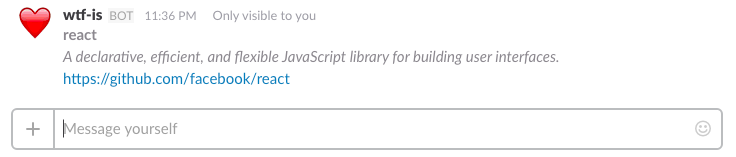

# WTF Is ... ?

Suppose you work with lots of microservices with funky codenames and you can't remember what on earth zozzfozzle-encoder actually is.

Suppose you also work somewhere that loves Slack or other bot-supported chat apps!

Well, look no further!

## WTF is 'WTF Is'?

It's a small service that, when connected to Slack or your chat platform of choice, takes the name of a repository and gives back some useful information. For example:

```
/wtfi zozzfozzle-encoder
```

> **zozzfozzle-encoder**
>
> _Encodes Zozzfozzles in a variety of formats, such as PowerPoint, CSV and PNG._
>
> https://github.com/zozzfozzle/zozzfozzle-encoder


You can also use this to find info for any *other* repo at a glance, so long as you specify the user/org like so:

```
/wtfi facebook/react
```



### Metadata

In addition to showing basic info about a repo, `wtfi` will search for a YAML file which is named after your username or organisation. For example, this repo has a file called `.leemachin.yml`. You can check the [reference format](metadata.reference.yml) to see what you're able to do. This allows you to explain what dependencies your service works with (as opposed to your library dependencies, although there's no restriction really), provide different links to documentation or useful resources, and expose all other kinds of information that different teams might find difficult to find.

If no such yaml file is present, you'll just get the basic Github output.

This specification was born at [Typeform](https://typeform.com), where we use this bot to provide at-a-glance insight to our repositories and services.

#### Validation

You can check that your metadata file is following the right format by adding `[validate]` to the end of your command:

```
/wtfi snorlax [validate]
```

It will let you know what problems you need to fix, if there are any.

### Installation

You'll need an AWS account so you can start making lambda functions. The documentation for [Claudia JS](https://claudiajs.com) tells you how to set things up, until I've added some scripts to make it easier.

Once you've installed that, you'll have to go to Slack or Telegram or whatever platform is supported to connect things up.

You will also need to add two environment variables to your lambda function:

- `GITHUB_TOKEN` - this is a user token that has access to you or your org's private repos
- `GITHUB_ORG` - your own username or that of your org, which is how the bot knows where to look for your services.
